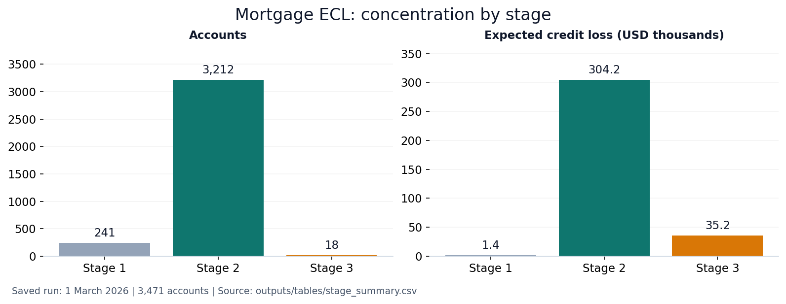

# IFRS 9 Mortgage ECL Model

This project calculates loan-level expected credit loss for a residential mortgage portfolio. It uses Freddie Mac loan data, FRED unemployment and real GDP data, and FHFA house-price data.

The main calculation is:

`Period ECL = Marginal PD × LGD × EAD × Discount Factor`

Each macroeconomic scenario is calculated in full before its probability weight is applied. Stage 3 uses a discounted recovery cash-shortfall calculation instead of performing-loan PD.

## Results at 1 March 2026

- Reporting date: 1 March 2026
- Active mortgages: 3,471
- Gross exposure: $432,963,771.97
- Probability-weighted ECL: $340,767.41
- Coverage ratio: 0.0787%
- Stage 1: 241 loans
- Stage 2: 3,212 loans
- Stage 3: 18 loans

The saved run reports 30 passing formula, reconciliation, staging, recovery, macro-availability and scenario-ordering controls. These are project checks, not independent model validation. Scenario ECL before probability weighting is $329,484 for Upside, $337,567 for Base and $372,053 for Downside.

Raw loan files and the local SQLite database are excluded from version control. The included notebooks, workbook and account-level reporting outputs use stable `RM` aliases. A fresh clone requires the source files listed in `data/input/README.md` before the pipeline can be rerun.



## Explore the analysis

[Download the Excel report](outputs/IFRS_9_Mortgage_ECL_Model.xlsx) · [Calculation map](notebooks/00_project_flow.ipynb) · [Staging](notebooks/12_sicr_and_staging.ipynb) · [Worked loan traces](notebooks/14_worked_loan_traces.ipynb)

### Interpreting the result

Stage 2 contains 92.5% of accounts and 91.0% of exposure. The large share is sensitive to the aged 2015 cohort and the configured lifetime-PD deterioration thresholds; it is not a representative estimate for all mortgage portfolios. The low overall coverage ratio must be read alongside the recovery/collateral assumptions and the LGD benchmark.

The PD satellite has negative out-of-time R-squared on a small default sample, and the fitted LGD model does not outperform its median benchmark on out-of-time MAE. These are material limits on predictive claims. The project demonstrates the complete ECL calculation and its controls, with the weaknesses retained in [assumptions and limitations](docs/assumptions_and_limitations.md).

## Model sequence

1. Read origination, monthly performance and macroeconomic data.
2. Apply the 90+ DPD and credit-event default definition.
3. Build loan-month features and delinquency transitions.
4. Fit the 12-month logistic PD and monthly hazard models.
5. Fit the PD macroeconomic satellite and construct three scenarios.
6. Compare hazard-based current and origination lifetime risk and assign IFRS 9 stages.
7. Fit workout LGD and project scenario collateral values.
8. Build conditional mortgage EAD and loan-specific discount factors.
9. Create the Loan × Scenario × Future Month projection cube.
10. Calculate scenario, loan, stage and portfolio ECL.
11. Write SQLite, CSV and Excel outputs.

## Notebooks

The repository includes executed notebooks with saved outputs and anonymized account references. Read them in numerical order. They show data review, WOE and IV, chronological model fitting and testing, macroeconomic calibration, staging, term structures, the projection equation, and worked Stage 1, Stage 2 and Stage 3 accounts.

The saved notebooks can be read on GitHub without source data. After local setup, open JupyterLab with:

```bash
python -m jupyterlab notebooks
```

## Run

Python 3.12 is the tested environment. Source files are required only to rerun the complete model; the saved report and notebooks can be reviewed immediately. See [input filenames](data/input/README.md) and [data sources](DATA_SOURCES.md).

Create and activate an environment:

```bash
python -m venv .venv
# macOS / Linux
source .venv/bin/activate
# Windows Command Prompt: .venv\Scripts\activate
# Windows PowerShell: .venv\Scripts\Activate.ps1
```

Then install and run:

```bash
python -m pip install --upgrade pip
python -m pip install -r requirements.txt
python run_pipeline.py
python scripts/build_notebooks.py --execute
```

`python -m pytest -q` checks the included reporting snapshots and model functions without downloading the raw source files. The automated workflow does not refit the full data-dependent model.

## Outputs and data access

- `database/ifrs9_ecl.sqlite3`: local calculation database
- `outputs/IFRS_9_Mortgage_ECL_Model.xlsx`: reporting workbook
- `outputs/tables/account_level_ecl.csv`: anonymized account report
- `outputs/tables/worked_trace_monthly.csv`: monthly worked calculations

The authoritative detailed table is `ecl_projection_cube`. SQLite views provide separate Base, Upside and Downside projections and detailed PD, LGD, EAD and discount-factor terms.


CSV ratios use decimal storage: `0.0007870576` means `0.07870576%`. The summary export explicitly labels these units; percentage-formatted Excel displays remain unchanged.

## Related projects

[Basel credit capital](https://github.com/keyurmarolia/basel-credit-capital-engine) · [FRTB market risk](https://github.com/keyurmarolia/frtb-market-risk-engine) · [Momentum research](https://github.com/keyurmarolia/momentum-in-indian-equities-research) · [InterGlobe valuation](https://github.com/keyurmarolia/interglobe-aviation-equity-research-model)
